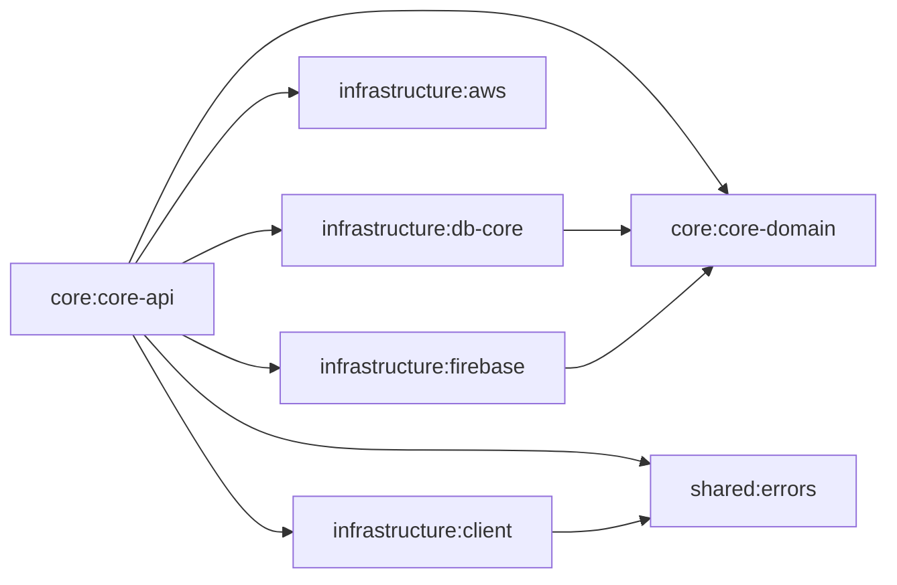

# Thunder API

This is a HTTP API server build with Spring Boot. It provides data and features for Thunder Flutter App.

## Table of Contents
- [Architecture](#architecture)
- [Installation](#installation)

## Architecture

### Installation
- need JDK 21 or higher
- environment variables file (provided by Thunder App Team)
